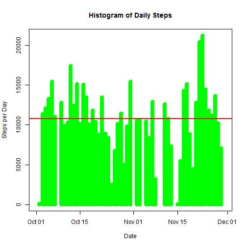
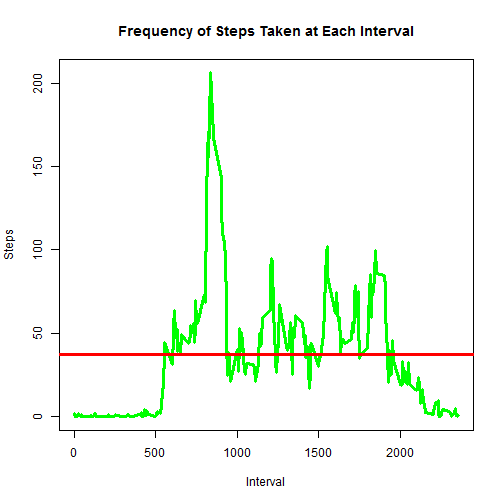
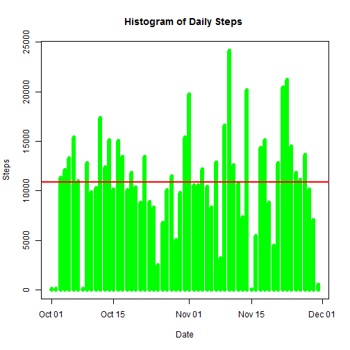
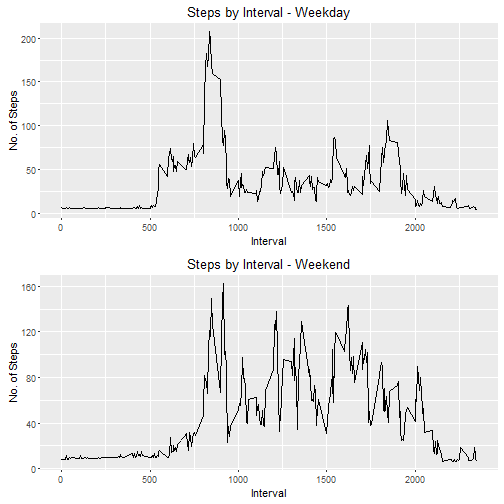

Introduction

It is now possible to collect a large amount of data about personal movement using activity monitoring devices such as a Fitbit, Nike Fuelband, or Jawbone Up. These type of devices are part of the "quantified self" movement - a group of enthusiasts who take measurements about themselves regularly to improve their health, to find patterns in their behavior, or because they are tech geeks. But these data remain under-utilized both because the raw data are hard to obtain and there is a lack of statistical methods and software for processing and interpreting the data.

This assignment makes use of data from a personal activity monitoring device. This device collects data at 5 minute intervals through out the day. The data consists of two months of data from an anonymous individual collected during the months of October and November, 2012 and include the number of steps taken in 5 minute intervals each day.


SECTION 1: Calculating and plotting the mean of the total number of steps per day
Step 1: Load the data from the source file

```r
# Load the raw activity data

raw_activity_data <- read.csv("activity.csv",header = TRUE)
```
Step 2: Process the raw data to make it for  analysis

```r
# Load reshape2,ggplot2 adn gridExtra library to get melt & dcast functions

library(reshape2)
library(ggplot2)
library(gridExtra)

raw_activity_data$date <- as.Date(raw_activity_data$date)

#melt the data frame
activity_melt_data <- melt(raw_activity_data,id.vars = "date",measure.vars = "steps",na.rm = FALSE)

#sums the steps by date
activity_Cast_data <- dcast(activity_melt_data,date ~ variable, sum)
```


```r
# Plot histogram of daily steps
daily_steps <- mean(activity_Cast_data$steps, na.rm=TRUE)
median_steps <- median(activity_Cast_data$steps,na.rm = TRUE)

plot(activity_Cast_data$date, activity_Cast_data$steps, type="h", main="Histogram of Daily Steps", xlab="Date", ylab="Steps per Day", col="green", lwd=8)
abline(h=daily_steps, col="red", lwd=2)
```



```r
paste("Mean Steps per Day =",daily_steps)
```

```
## [1] "Mean Steps per Day = 10766.1886792453"
```

```r
paste("Median Steps per Day =",median_steps)
```

```
## [1] "Median Steps per Day = 10765"
```

SECTION 2: Find the average daily activity pattern

```r
# melt the data frame by Interval
activity_melt_Interval <- melt(raw_activity_data,id.vars="interval", measure.vars="steps", na.rm=TRUE)

# cast the data frame to find the mean steps interval 
activity_Cast_Interval <- dcast(activity_melt_Interval,interval ~ variable, mean)

#Plot Frequency of Steps Taken at Each Interval
  
mean_steps <- mean(activity_Cast_Interval$steps,na.rm = TRUE)

plot(activity_Cast_Interval$interval,activity_Cast_Interval$steps, type = "l", col="green",main="Frequency of Steps Taken at Each Interval", xlab="Interval", ylab="Steps",lwd =3)
abline(h=mean_steps,col='red',lwd=3)
```



```r
#Interval with max value
paste("Interval with max value =", activity_Cast_Interval$interval[which(activity_Cast_Interval$steps == max(activity_Cast_Interval$steps))])
```

```
## [1] "Interval with max value = 835"
```

```r
#Maximum interval mean steps 
paste("Maximum interval mean steps =", max(activity_Cast_Interval$steps))
```

```
## [1] "Maximum interval mean steps = 206.169811320755"
```

SECTION 3: Imputing missing values to replace NAs in data set and compare results


```r
# Calculate number of rows in activity data set with NA rows
sum(is.na(raw_activity_data$steps))
```

```
## [1] 2304
```

```r
#Mean steps per Interval
steps_per_Interval <- activity_Cast_Interval

no_steps_Index <- which(is.na(raw_activity_data$steps))
# Merge activity data set with steps per Interval data set

temp_no_na_date <- raw_activity_data
merged_data <- merge(temp_no_na_date, steps_per_Interval, by="interval", suffixes=c(".act", ".spi"))

# Replace NA values with value from steps.spi

temp_no_na_date[no_steps_Index,"steps"] <- merged_data[no_steps_Index,"steps.spi"]
no_na_data <- temp_no_na_date

# Plot histogram and calculate mean and median of total steps/day with new (no NA) data set and compare with original

melt_no_na_data <- melt(no_na_data, id.vars="date", measure.vars="steps", na.rm=FALSE)
cast_no_na_data <- dcast(melt_no_na_data,date ~ variable, sum)

plot(cast_no_na_data$date, cast_no_na_data$steps, type="h", main="Histogram of Daily Steps ", xlab="Date", ylab="Steps", col="green", lwd=6)
abline(h=mean(cast_no_na_data$steps), col="red", lwd=2)
```



```r
# Calculate mean and median of daily steps
paste("Mean daily steps =", mean(cast_no_na_data$steps, na.rm=TRUE))
```

```
## [1] "Mean daily steps = 10889.7992576554"
```

```r
paste("Median daily steps =", median(cast_no_na_data$steps, na.rm=TRUE))
```

```
## [1] "Median daily steps = 11015"
```


SECTION 4: Find differences in activity patterns between weekdays and weekends


```r
for (i in 1:nrow(no_na_data)) {
  if (weekdays(no_na_data$date[i]) == "Saturday" | weekdays(no_na_data$date[i]) == "Sunday") {
    no_na_data$dayOfWeek[i] = "weekend"
  } else {
    no_na_data$dayOfWeek[i] = "weekday"
  }
}


weekday <- subset(no_na_data, dayOfWeek=="weekday")
weekend <- subset(no_na_data, dayOfWeek=="weekend")

melt_weekday <- melt(weekday, id.vars="interval", measure.vars="steps")
melt_weekend <- melt(weekend, id.vars="interval", measure.vars="steps")
cast_weekday <- dcast(melt_weekday, interval ~ variable, mean)
cast_weekend <- dcast(melt_weekend, interval ~ variable, mean)


plot_a <- qplot(cast_weekday$interval, cast_weekday$steps, geom="line", data=cast_weekday, main="Steps by Interval - Weekday", xlab="Interval", ylab="No. of Steps")
plot_b <- qplot(cast_weekend$interval, cast_weekend$steps, geom="line", data=cast_weekend,  main="Steps by Interval - Weekend",xlab="Interval", ylab="No. of Steps")
grid.arrange(plot_a, plot_b ,nrow=2)
```


